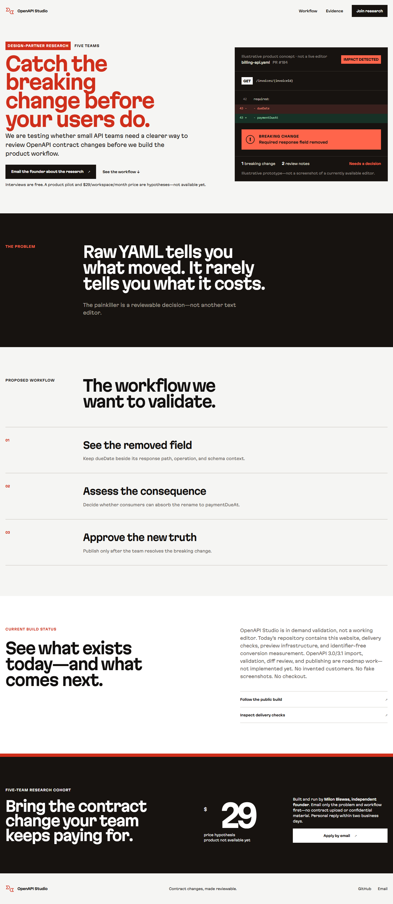

# OpenAPI Studio

Review consequential OpenAPI contract changes before they reach users.

> **Founding build:** OpenAPI Studio is not a finished editor or self-serve product. The public repository currently proves the delivery foundation, demand test, and proposed review workflow. Product capabilities are built only after design-partner evidence.

[](https://github.com/bymilon/openapi-studio-tanstack/actions/workflows/quality.yml)



_Website preview—not product UI._

[View the live preview](https://openapi-studio-tanstack-preview.pibin.workers.dev) · [Join design-partner research](mailto:pitechae@gmail.com?subject=OpenAPI%20Studio%20design-partner%20research) · [Read the product roadmap](specs/roadmap.md)

## The problem

Raw OpenAPI diffs show which lines moved, but teams still have to determine what may break, who is affected, and whether the new contract should be published. OpenAPI Studio is testing a focused workflow that keeps the change, consequence, and team decision connected.

## What exists today

| Area                    | Current evidence                                                                         |
| ----------------------- | ---------------------------------------------------------------------------------------- |
| Design-partner research | Responsive landing page, qualified email path, explicit `$29/workspace/month` hypothesis |
| Delivery                | Cloudflare Workers preview, locked Bun install, GitHub Actions validation                |
| Quality                 | TypeScript, Oxlint, Oxfmt, Vitest, Playwright, axe accessibility checks                  |
| Data foundation         | Drizzle schema, committed migration, local migration and database smoke checks           |
| Operations              | Request observability and identifier-free first-party conversion events                  |
| Product design          | Labelled OpenAPI review prototype and evidence-gated roadmap                             |

## What does not exist yet

- No production OpenAPI editor or account access
- No contract import, validation, diff engine, revision history, or publishing workflow
- No customers, usage claims, testimonials, checkout, or billing
- No production deployment or custom domain

The next product phase is intentionally gated on qualified conversations and pilot commitment. See [PRODUCT.md](PRODUCT.md), [DESIGN.md](DESIGN.md), and the [roadmap](specs/roadmap.md) for the decisions behind that boundary.

## Architecture

This is a single-package modular monolith using TanStack Start with Solid, TypeScript, Cloudflare Workers, Bun, Turso/libSQL, Drizzle ORM, Valibot, Tailwind CSS, Oxlint, Oxfmt, Vitest, and Playwright. Feature code lives under `src/features`; platform boundaries live under `src/platform`; migrations live under `drizzle`; browser and unit tests live under `tests` and adjacent feature files.

## Local development

Requires Bun 1.3.14 or a newer 1.x release.

```bash
bun install --frozen-lockfile
bun run dev
```

Run the same validation used by CI:

```bash
bun run check
```

Database access expects `TURSO_DATABASE_URL` and `TURSO_AUTH_TOKEN`. Copy `.env.example` to an ignored local environment file. Local development and CI do not require production credentials. `bun run deploy:preview` is human-gated; no production deployment command exists.

## Contributing and security

Read [CONTRIBUTING.md](CONTRIBUTING.md) before proposing a change. Do not report vulnerabilities in public issues; follow [SECURITY.md](SECURITY.md). Never submit real API contracts, customer data, credentials, or confidential material.

## Source terms

The repository is public for transparency and technical evaluation, but it is not currently open source. No reuse rights are granted. See [LICENSE](LICENSE).
